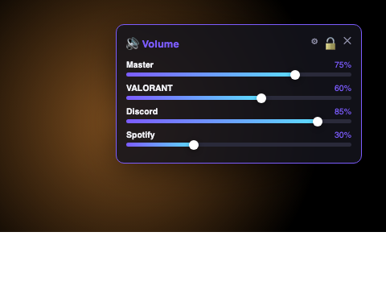

# Volume Overlay

A frameless, always-on-top Windows overlay for controlling **master volume** and **per-app volume** while gaming. Like Windows' Volume Mixer, but it sits over your game.



## Features

- **Master + per-app volume sliders** — drag to adjust live
- **Visible volume picker** — choose which apps appear on the overlay (Game + Master, Discord only, all four, whatever)
- **Movable** — drag the header anywhere on screen
- **Lock toggle** — 🔒/🔓 button keeps it from being dragged accidentally
- **Transparency slider** — 20%–100%
- **Color customization** — background, accent, text
- **Position + settings persist** — saved to `~/.volume_overlay.json`
- **External-change sync** — if you change volume in Windows directly, the overlay catches up

## Requirements

- Windows 10 or 11
- Python 3.9+

## Install + Run (Python)

```bat
pip install -r requirements.txt
python volume_overlay.py
```

## Build a standalone .exe

Run `build_exe.bat` on Windows. It produces `dist\VolumeOverlay.exe` — a single file, no Python install needed on the target machine.

```bat
build_exe.bat
```

## Controls

| Button | Action |
| --- | --- |
| ⚙ | Settings (transparency, colors, app picker) |
| 🔒 / 🔓 | Lock position |
| ✕ | Close |
| Drag header | Move overlay (when unlocked) |

## Settings menu

- **Transparency** — slider from 20% (mostly see-through) to 100% (opaque)
- **Colors** — background, accent, text (color picker)
- **Visible Volumes** — checkboxes for Master + every running app with audio. Pick which sliders appear on the overlay.
- **Refresh app list** — rescan for new apps (e.g. after launching your game)

## Config file

Settings are saved to `%USERPROFILE%\.volume_overlay.json`. Delete it to reset to defaults.

## Why Python instead of C#?

Python + `pycaw` gives full Core Audio access (same APIs Windows uses internally), the script is one file, and it ships as a ~20 MB exe via PyInstaller. C#/WPF would be more native but a much bigger project for the same result.

## License

MIT.
